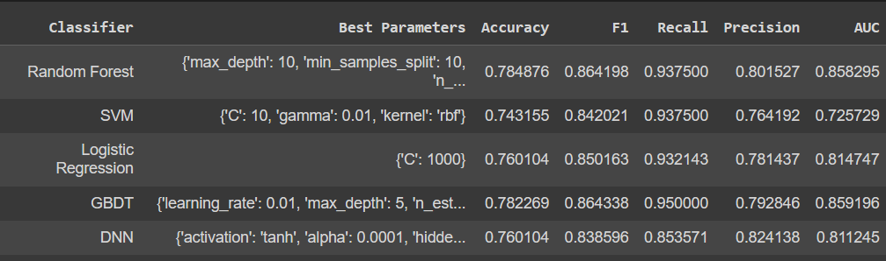
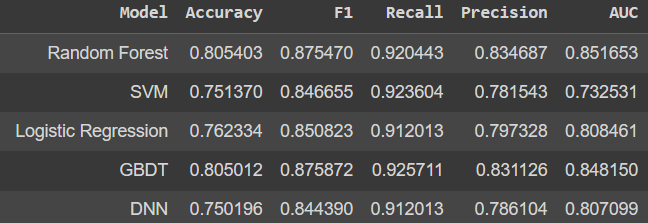

# ICD9 Predict
## 復現環境建置
```
conda env create -f ./requirement.yml
conda activate icd9_predict
```

## 復現環境建置#2
```
conda create -n icd9_predict python=3.9
conda activate icd9_predict
pip install pandas==1.5.3
pip install scikit-learn
pip install jupyter notebook
```

## 資料
- 資料清理後: 2554筆 
- 標籤: 1: 1898, 0: 656
- 處理後特徵9欄、Taeget 1欄


## 方法
- RandomForest
- SVM
- Logistic Regression
- GBDT
- DNN

## 超參數搜尋
- 網格超參數搜尋

## 結果(模型評估)
### 簡單拆分訓練7測試3(最佳超參數)


### 5-fold
